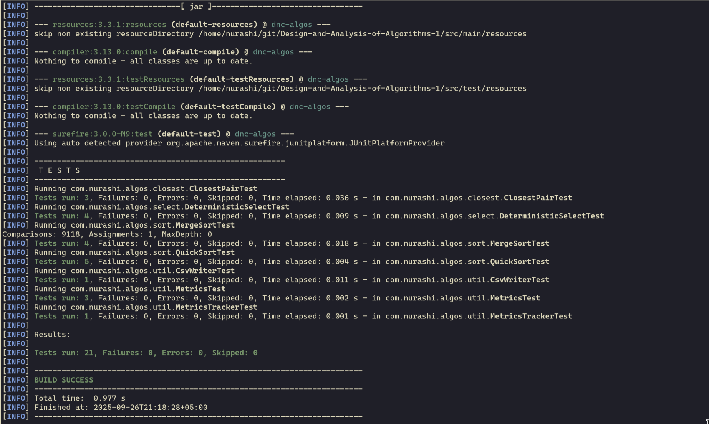

# Design and Analysis of Algorithms

A comprehensive Java implementation of fundamental divide-and-conquer algorithms with performance analysis and benchmarking capabilities.

## 📋 Table of Contents

- [Design and Analysis of Algorithms](#design-and-analysis-of-algorithms)
  - [📋 Table of Contents](#-table-of-contents)
  - [Overview](#overview)
  - [Algorithms Implemented](#algorithms-implemented)
    - [Sorting Algorithms](#sorting-algorithms)
    - [Selection Algorithm](#selection-algorithm)
    - [Computational Geometry](#computational-geometry)
  - [Features](#features)
  - [Prerequisites](#prerequisites)
  - [Installation](#installation)
  - [Usage](#usage)
    - [Command Line Interface](#command-line-interface)
    - [Output Format](#output-format)
    - [Custom Performance Analysis](#custom-performance-analysis)
  - [Testing](#testing)
  - [📁 Project Structure](#-project-structure)
  - [Performance Metrics](#performance-metrics)
    - [Algorithm Complexity](#algorithm-complexity)
    - [Tracked Metrics](#tracked-metrics)

## Overview

This project implements and analyzes several key divide-and-conquer algorithms, providing both educational insight and practical performance measurements. Each algorithm is instrumented with detailed metrics tracking including comparisons, memory allocations, and recursion depth.

##  Algorithms Implemented

### Sorting Algorithms
- **Merge Sort**: Stable divide-and-conquer sorting with O(n log n) guaranteed performance
- **Quick Sort**: Randomized pivot selection with tail-call optimization

### Selection Algorithm
- **Deterministic Select**: Median-of-medians algorithm for finding the k-th smallest element in O(n) worst-case time

### Computational Geometry
- **Closest Pair**: Divide-and-conquer solution for finding the closest pair of points in 2D space

## Features

- **Performance Metrics**: Comprehensive tracking of algorithm performance including:
  - Number of comparisons
  - Memory allocations
  - Maximum recursion depth
  - Execution time
- **CLI Interface**: Command-line runner for easy algorithm execution and testing
- **CSV Export**: Performance data export for analysis and visualization
- **Comprehensive Testing**: Full JUnit test coverage for all algorithms
- **Maven Build**: Standard Maven project structure with dependency management

##  Prerequisites

- **Java 17** or higher
- **Maven 3.6+** for building and dependency management

##  Installation

1. Clone the repository:
```bash
git clone https://github.com/nurashi/Design-and-Analysis-of-Algorithms-1.git
cd Design-and-Analysis-of-Algorithms-1
```

2. Build the project:
```bash
mvn clean compile
```

3. Run tests to verify installation:
```bash
mvn test
```

4. Package the application:
```bash
mvn package
```

##  Usage

### Command Line Interface

Run algorithms using the CLI:

```bash
java -cp target/classes com.nurashi.algos.App <algorithm> <n> [k]
```

**Parameters:**
- `algorithm`: Algorithm name (`mergesort`, `quicksort`, `select`, `closest`)
- `n`: Input size
- `k`: Position for select algorithm (0-indexed)

**Examples:**

```bash
 java -cp target/classes com.nurashi.algos.App mergesort 1000 > csv/results.csv

 java -cp target/classes com.nurashi.algos.App quicksort 1000 > csv/results.csv

java -cp target/classes com.nurashi.algos.App closest 100 10 > csv/results.csv

java -cp target/classes com.nurashi.algos.App closest 100 10 > csv/results.csv
```

### Output Format

The CLI outputs performance metrics in CSV format:
```
algorithmName;runTime;counter;depth;allocation
mergesort;15;552;0;1
```

Where:
- `runTime`: Execution time in milliseconds
- `counter`: Number of comparisons performed
- `depth`: Maximum recursion depth reached
- `allocation`: Number of array allocations

### Custom Performance Analysis

The project includes utilities for generating performance data:

```java
Metrics metrics = new Metrics();
int[] arr = generateRandomArray(1000);
MergeSort.sort(arr, metrics);

System.out.println("Comparisons: " + metrics.getComparisons());
System.out.println("Allocations: " + metrics.getAllocations());
System.out.println("Max Depth: " + metrics.getMaxRecursionDepth());
```

## Testing

Run the comprehensive test suite:

```bash
# Run all tests
mvn test


```

Test coverage includes:
- Algorithm correctness verification
- Edge case handling
- Performance metric accuracy
- Utility function validation

## 📁 Project Structure

```
src/
├── main/java/com/nurashi/algos/
│   ├── App.java                    # Main application entry point
│   ├── bench/                      # JMH benchmark implementations
│   │   └── SelectBench.java
│   ├── cli/                        # Command-line interface
│   │   └── Runner.java
│   ├── closest/                    # Closest pair algorithm
│   │   ├── ClosestPair.java
│   │   └── Point.java
│   ├── select/                     # Selection algorithm
│   │   └── DeterministicSelect.java
│   ├── sort/                       # Sorting algorithms
│   │   ├── MergeSort.java
│   │   └── QuickSort.java
│   └── util/                       # Utility classes
│       ├── array/ArrayUtils.java   # Array manipulation utilities
│       └── metrics/                # Performance tracking
│           ├── Metrics.java
│           ├── MetricsTracker.java
│           └── CsvWriter.java
└── test/java/                      # Comprehensive test suite
    └── com/nurashi/algos/
        ├── closest/ClosestPairTest.java
        ├── select/DeterministicSelectTest.java
        ├── sort/
        │   ├── MergeSortTest.java
        │   └── QuickSortTest.java
        └── util/                   # Utility tests
```

## Performance Metrics

The project tracks several key performance indicators:

### Algorithm Complexity
- **Merge Sort**: O(n log n) time, O(n) space
- **Quick Sort**: O(n log n) average, O(n²) worst case
- **Deterministic Select**: O(n) worst case time
- **Closest Pair**: O(n log n) time, O(n) space

### Tracked Metrics
- **Comparisons**: Element comparison operations
- **Allocations**: Array and object allocations
- **Recursion Depth**: Maximum call stack depth
- **Execution Time**: Wall-clock time in milliseconds

